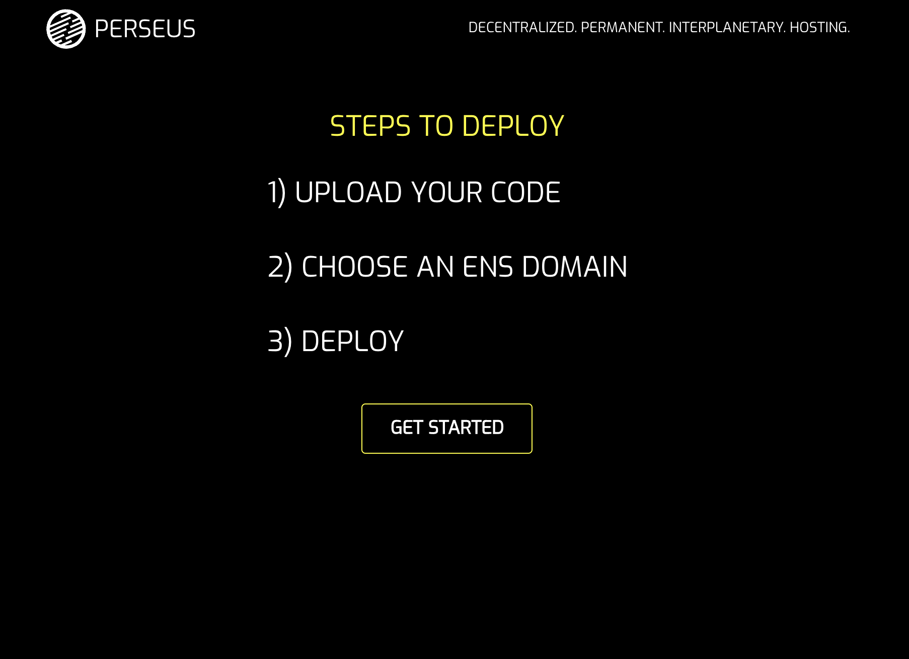
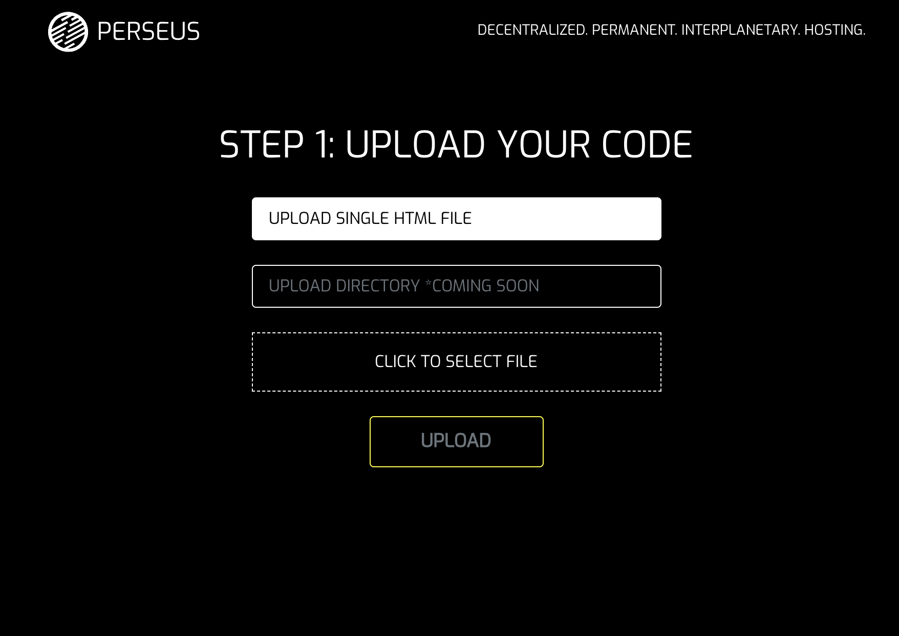
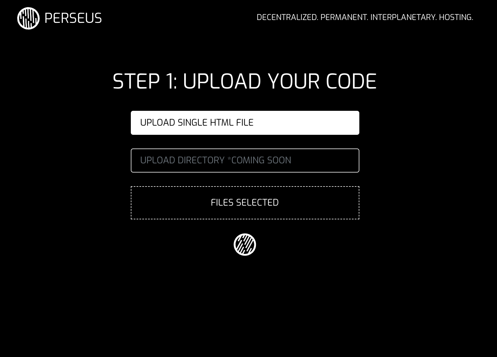
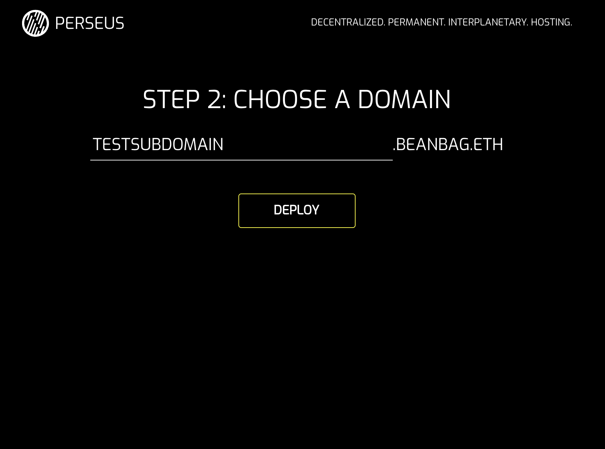

# Perseus

> Perseus is the simplest gateway to the decentralized web. With the benefit of Arweave, ENS and IPFS, users can post and host and share with others seamlessly.

## Why did we build Perseus?

The potential of the decentralized web is clear. It's uncensorable and, in the case of Arweave, permanent. But deploying to Arweave and using ENS and IPFS can be intimidating. We wanted to build the simplest, most straightforward user experience for deploying to Arweave and registering on ENS.

## What is Perseus?

Perseus is supposed to be fun. We wanted users to be able to deploy easily and cheaply, so we offer the opportunity to register subdomains to avoid the pain points of the full-fledged ENS experience. Our first subdomain is 'beanbag.eth'. More to come.

## What's Next?

- Building on Arweave's more dynamic features, like packaging
- Offering different subdomains through ENS (and maybe full domains)
- Making Perseus social


## Running Perseus

Perseus will be deployed shortly at [perseus.online](https://perseus.online). You can run it locally with ```npm install && npm start```. For now, Perseus is only deployed on Ropsten.







